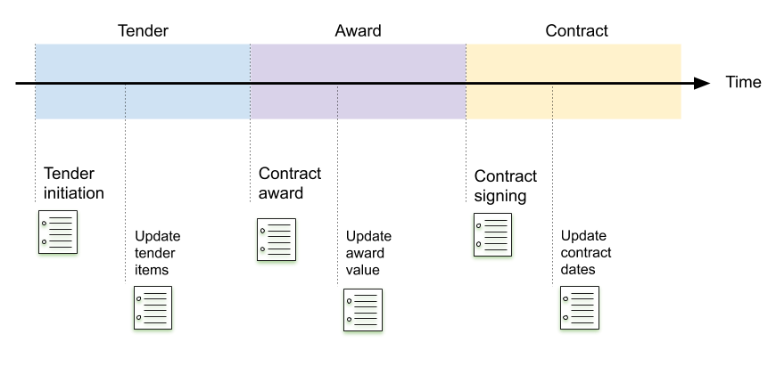

# Change History

The tracking of all changes in a contracting process can be important for a publisher's open contracting goals. For example, frequent changes or amendments in the process can signal for corruption cases (red flags), or for opportunities of improvement in public contracting management.

Publishers are encouraged to publish any changes in the contracting process in real time, when possible. OCDS supports real-time publication with the Releases and Records model, which defines the document formats to use and how to publish updates.

## The Releases and Records model

Releases and records are the JSON document formats supported by OCDS. These formats are not independent (records require the use of releases), but they can be seen as alternative publication formats. Publishers should decide whether to use releases, records or both to better support of their goals.

Consider the timeline of a contracting process. While OCDS identifies five possible stages in the timeline (planning, tender, award, contract, implementation) there can be multiple events on each stage. The image below shows a slice of the timeline in a contracting process.


Where there are main events that take the process from one stage to another, like an award notice, there are others that add changes within the same stage, like increasing the value of an awarded contract, or extending its expiring date. In OCDS, these changes are documented with **Releases**. Releases are JSON documents, published each time there is any update in the contracting process. 



Releases are **immutable**, therefore each change should be documented in a **new** release. The history of a contracting process, then, is represented by the collection of all releases published for the process.

**Records** are JSON documents that aggregate all releases of a single contracting process, or links to the release documents. While releases should never be updated, records should be updated each time there is a change to add a new release (or a link to) to the collection. There should be a single record for each contracting process at all times.

Records may contain additional structures:

* A *compiled release*, which represents the latest state of a contracting process.
* A *versioned release*, that contains the changes at field level.

These structures help the users that may be only interested in current or latest stages, or in the changes for particular fields in the process.

### Releases

Each release needs to contain an `ocid`, and an identifier *unique* in the context of its contracting process. A [release id](../schema/identifiers/#release-id) can be built in several ways, and a publisher can use any generation strategy as long as the ids don't clash for a same contracting process.

When published, releases should be always wrapped in a [release package](../schema/release_package/) to provide context to the data. The `uri` package field should contain an URI to an online copy of the same release. In a complete OCDS implementation, each release would be published at its own persistent URL, and kept online permanently.

Each release also needs to provide one or more`tag`s. Tags provide information about the event the release is providing details about.

For example: 

* A release with the 'planning' tag can provide information in the `planning` section about budgets and procurement intention, and the `tender` section about the proposed details for a future tender;
* A  release with the 'tender' tag can provide information in the `tender` section about how to bid for the work, and can repeat `planning` section information on the budget or project the tender is associated with;
* A release with the 'tenderUpdate' tag can provide an updated `tender` section with links to documents that answer questions asked during the enquiry period;
* A release with the 'award' tag can provide details of the supplier awarded the contract in the `award` section, and can provide repeated information about the how procurement took place in the `tender` section;
* A release with the 'contract' tag can provide the details of the signed contract in a `contract` section, matched with a related `award` section;
* A release with the 'implementationUpdate' tag can repeat details of the `contract`, and provide information on milestones achieved and payments to the supplier, or can update the contract `implementation` section with links to newly published documents. 

The [Release tag codelist](../schema/codelists/#release-tag) contains the list of all tags provided by OCDS. Note that it is valid to use more than one tag in the same release. For example, a `tenderUpdate` and an `award` tags could be used together in a release that provides award information and also updates the number of tenderers.

Releases can include new information only, or it can contain part or all unchanged data from previous releases along with the new/updated data. Both alternatives are equally valid and publishers can choose how much unchanged data to include in their releases while being careful of always including required fields.

The following example presents releases from a contracting process with minimal changes on each update. The first release presents tender data. The second introduces a new document in the tender section with the `tenderUpdate` tag. Note that all not-required tender fields are omitted, even the award notice present in the previous release.  The third release presents award data, and the complete tender section is omitted.

```eval_rst

.. jsoninclude:: ../examples/minimal_updates/tender.json
   :jsonpointer: 
   :expand: releases, tender

```

```eval_rst

.. jsoninclude:: ../examples/minimal_updates/tenderUpdate.json
   :jsonpointer: 
   :expand: releases, tender

```

```eval_rst

.. jsoninclude:: ../examples/minimal_updates/award.json
   :jsonpointer: 
   :expand: releases, award

```

### Records

Records contain the history of a contracting process as a group of releases. Releases can be embedded in the record, or a list of URLs to the releases can be provided inside it, see the [Record reference](../schema/records_reference/#release-list) for an example.

A **compiled release** follows the release structure and contains the latest value for all fields that have been filled in the releases of a contracting process. The next section shows a few examples. It is strongly recommended to include a compiled released when producing records.

A **versioned release** follows a structure similar to the release, but each final field contains an object with the history of the field. See the [Record reference](../schema/records_reference/#versioned-release) for an example.

When publishing, records should be always published wrapped in a [Record Package](../schema/records_reference/#package-metadata), with a URI leading to a copy of the package and record.

## Worked example

The following shows a step by step example of a contracting process.

### Planning

In order to prepare the market for the tender which is planned for later in the year, a procuring entity publishes a 'notice of planned procurement' (also known as 'prior information notice' or 'future opportunity notice'), which is represented in OCDS with a release with the 'planning' tag.

The information is presented in a new immutable release. The release uses the 'planning' tag to indicate that the tender is still being planned, and the 'tender' section is being filled with draft data from the current tender proposal.

The record belonging to the contracting process has the 'planning' release, the only one that exists for the process at the moment. The compiled and versioned releases inside the record contain the latest information, which should be very similar to the 'planning' release. See the record example by selecting 'record' in the box below.

```eval_rst

.. jsoninclude:: ../examples/planning.json
   :jsonpointer: /releases
   :expand: releases, planning, tag, documents
   :title: release

```

```eval_rst

.. jsoninclude:: ../examples/records/planning.json
   :jsonpointer: 
   :expand: records, releases, planning, tag, documents
   :title: record

```

### Tender

The procuring entity is ready to invite bids for the contract, so they issue the tender via an 'notice of intended procurement' (also known as 'contract notice' or 'opportunity notice'). In OCDS, this event is represented with a new release, using the 'tender' tag and providing details in the 'tender' section. 

In the immutable release the actual dates for bid submissions are reflected, along with additional information like items, documents, and predicted values.

The record for the contracting process has two immutable releases, and the compiled release has been updated to reflect the latest values for the new and updated fields in the 'tender' release. Note that the bid submission dates have been updated in the compiled release, and the versioned release now contains all registered changes for the same fields.

```eval_rst

.. jsoninclude:: ../examples/tender.json
   :jsonpointer: /releases
   :expand: releases, tender, items, tag, documents
   :title: release

```

```eval_rst

.. jsoninclude:: ../examples/records/tender.json
   :jsonpointer: 
   :expand: records, releases, compiledRelease
   :title: record

```

### Tender Update

The enquiry period has ended, and a few questions from potential suppliers have been received. The procuring entity issues a document with the responses to the enquiries received from bidders. A new immutable release adds the document and an amendments block, to include a justification for the change. The `hasEnquiries` field is set to `true`.

The publisher has decided to include all unchanged fields and values for the previous immutable release in the new one. 

The record for the contracting process now has three immutable releases, and updated compiled and versioned releases. Note that the compiled release has includes the enquiries document in the tender section, and the field `hasEnquiries` has more than one entry in the versioned release.

```eval_rst

.. jsoninclude:: ../examples/tenderUpdate.json
   :jsonpointer: /releases
   :expand: releases, tender, tag, documents
   :title: release

```

```eval_rst

.. jsoninclude:: ../examples/records/tenderUpdate.json
   :jsonpointer: 
   :expand: records, releases, compiledRelease, versionedRelease
   :title: record

```

### Award

The procuring entity awards the contract to Balfour Beatty. The new immutable release contains an `award` block, and the `parties` array is updated to include information about the new supplier. The full `tender` block is included as well, and the `status` field is set as 'complete', to denote that the tender process has finished.

The record for the contracting process has been updated to include the recent immutable release, and the compiled and versioned releases have been updated accordingly. The compiled release has an `award` block and the new supplier in `parties`, and the status of the tender has been updated to 'complete' as well. The versioned release also reflects the change in the `status` field.

```eval_rst

.. jsoninclude:: ../examples/award.json
   :jsonpointer: /releases
   :expand: releases, awards, value, suppliers, items, contractPeriod, tag, documents
   :title: release

```

```eval_rst

.. jsoninclude:: ../examples/records/award.json
   :jsonpointer: 
   :expand: records, compiledRelease, versionedRelease
   :title: record

```

### Contract

After the standstill period has passed and no complaints have been issued against the award of the contract, the procuring entity and the supplier sign the contract. The new immutable release includes a `contracts` block with the relevant information about the contract.

The record now has an additional immutable release, and the compiled and versioned releases now include the contract section with no other changes.

```eval_rst

.. jsoninclude:: ../examples/contract.json
   :jsonpointer: /releases
   :expand: releases, contracts, period, value, items, tag, documents
   :title: release

```

```eval_rst

.. jsoninclude:: ../examples/records/contract.json
   :jsonpointer: 
   :expand: records, compiledRelease, versionedRelease
   :title: record

```


### Implementation

The supplier has started the construction work, and the procuring entity makes the first two payments against the contract using their finance system, which shares a common contract identifier with the contract register. Additionally, a new progress report has been written to document the progress to date. An immutable release is published.

The release uses the 'implementation' tag to indicate that the contract is being executed. Payment information is added to the `implementation` block in contracts, and the report is added as a document in the contracts block. The contract description has been updated to describe that the contract is being monitored.

The record is updated by adding the latest immutable release. Both compiled and versioned releases are updated to include the change in the contract description, and the updates in the contracts block.

```eval_rst

.. jsoninclude:: ../examples/implementation.json
   :jsonpointer: /releases
   :expand: releases, contracts, implementation, transactions, tag, documents
   :title: release

```

```eval_rst

.. jsoninclude:: ../examples/records/implementation.json
   :jsonpointer: 
   :expand: records, compiledRelease, versionedRelease
   :title: record

```

### Contract Amendment

Due to unforeseen complications with subsistence in the area of the works, the procuring entity and the supplier agree a contract extension to cover the additional time and cost required to complete the works. The contract register is updated with the new contract value and period and a modification notice is issued, this is represented in OCDS with a new immutable release with the `contractAmendment`tag.

The word 'amendment' usually has a legal meaning, implying an official authorization is needed to make the change. In the present example, a change in the duration and value of a contract requires an official approval, for which the `contractAmendment` tag is used. Publishers should evaluate when a change requires a formal approval or not to use 'amendment' or 'update' tags.

As in the Tender Update step above, an `amendments`block is used to provide the justification of the change. The `amendsReleaseID` field provides the release id of the last immutable release that contain the field values previous to the change (the 'implementation' release), and the value and duration of the contract are changed in the present immutable release (in the `contracts/value/amount` and `contract/period/endDate` fields).

The record for the contracting process is updated. The compiled release reflects the new values, and the versioned release shows new entries for the contract's value and end date.

```eval_rst

.. jsoninclude:: ../examples/contractAmendment.json
   :jsonpointer: /releases
   :expand: releases, contracts, implementation, transactions, tag, documents
   :title: release

```

```eval_rst

.. jsoninclude:: ../examples/records/contractAmendment.json
   :jsonpointer: 
   :expand: records, compiledRelease, versionedRelease
   :title: record

```
