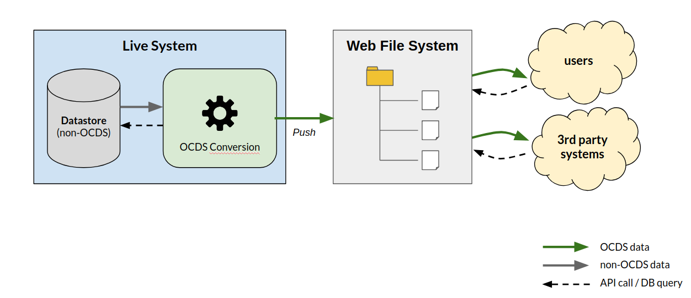
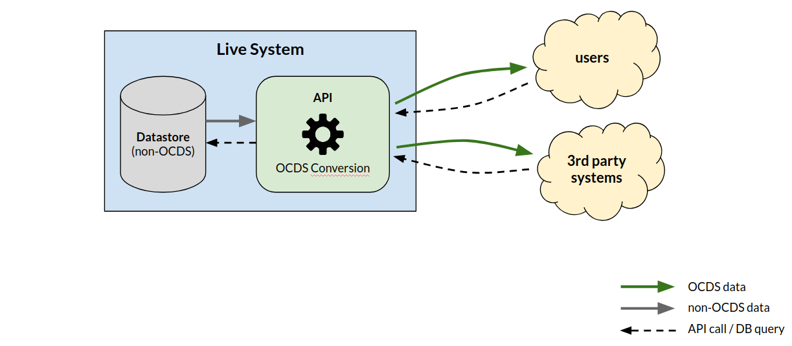
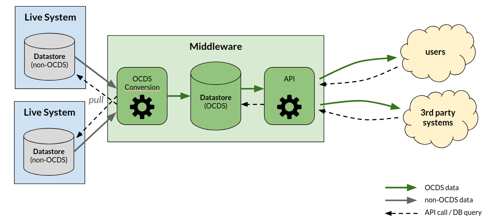
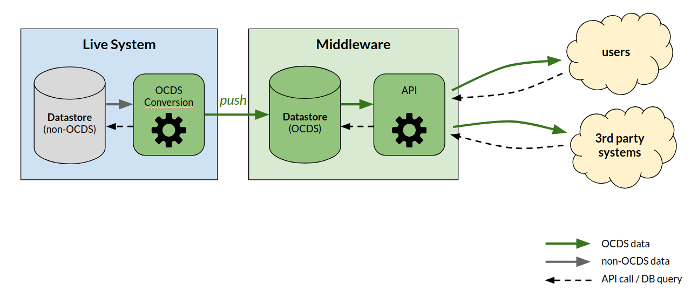
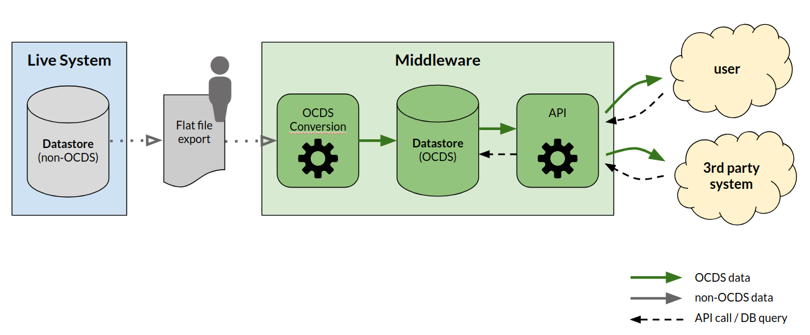

# System architectures

The publication of OCDS documents requires the design of an architecture that extracts data from live systems, convert them to OCDS and serve it to users and third party systems.

The design of an architecture depends of several factors:

* If existing systems need to be modified, or a new system would be built,
* The number and disposition of the live systems,
* The resources available to the publisher, like storage and processing capabilities and the availability of technical personnel to mantain systems and modules. 

In the ideal scenario:

* Individual releases and records for each contracting process should be available at unique persistent URLs;
* Bulk downloads in JSON, CSV (and, if appropriate, Excel) format should be available covering set periods of contracting;
* Users should be able to easily locate the collections of releases and records they want.

The following describes high-level architecture approaches that can be used, with their advantages and disadvantages. These approaches are by no means an extensive or exclusive list, but can be used as templates for publishers to design their own architectures.

## On-demand transformation from live systems

In this scenario each originating system converts data directly in OCDS format on demand. Data is not stored according to OCDS but is converted each time the conversion process is invoked. This can be the easiest path when all contracting processes are managed by a single live system, although it requires modifications to add an OCDS conversion module.

An alternative of the approach is to write to a web-accesible file system, as illustrated below, and update it periodically by invoking the conversion module.

Another one is to implement an API, which performs data transformation on the fly, each time a request is received.

In both alternatives, the OCDS Conversion module produces OCDS immutable releases and/or records, wrapped in release/record packages.

The file system alternative ensures that each OCDS document can be accessed through a persistent URL, but the volume of data can grow quickly as plain files can take significant space. Bulk downloads can be generated periodically and stored in the file system.

The API alternative does not require additional storage space, but it may be not possible to provide persistent URLs for immutable releases. Bulk downloads can be provided as part of the API, although it may strees the live systems with large data queries.

Another potential issue for both alternatives is that immutable releases can be produced **only** if the live systems stores the change history for contracting processes. The [Easy releases](./easy-releases.md) guidance explains alternative methods that allows users to keep their own OCDS datastore, when publishers cannot consider a separate OCDS datastore as described next.

## Separate OCDS datastore

In the scenarios that follow, data is converted to and stored in OCDS format. This has some advantages:

* When having multiple systems, data can be merged and centralized in a single datastore;
* It may relieve live systems from expensive queries;
* It may enable the generation of the change history for each contracting process;

at cost of additional mantainance. In these scenarios, an API is assumed to provide access to OCDS documents.

Publishers should consider how to store OCDS structures. Immutable releases can be stored as they are, but records could be built on each API call including compiled and/or versioned releases (or, alternatively, store compiled and versioned releases and update them each time an immutable release is added to the datastore). Packaging can be built on each call as well.

### Pull and convert

In this scenario a middleware system sits between live systems and the internet facing API. An automated process pulls data from live systems to the middleware system which performs the conversion to OCDS and maintains a datastore in OCDS format.

This approach does not require any modification to live systems, and the OCDS Conversion module can also merge data if needed (e.g. when data is extracted from a procurement system and a financial system). It also eases the task of adding another source system in the future.

A similar approach has been adopted by European Dynamics to support OCDS output from a new e-procurement system for the Zambian Public Procurement Agency, the key difference being that data is pushed rather than pulled from the live e-procurement systems whilst conversion takes place at the middleware layer.

### Convert and push

This scenario can be viewed as a combination of the two previous scenarios. Live systems perform the conversion of data to OCDS format and push this to a middleware system which maintains an OCDS format datastore and an internet facing API.

Although this approach puts the burden of data conversion in live systems, it may be adequate solution for publishers that have a single source system with no history track for contracting processes.

A similar approach has been adopted by the [OpenProcurement](http://openprocurement.org/en/) system, developed in Ukraine and used as the basis for the [Prozorro](https://prozorro.gov.ua/en/) platform, which uses OCDS building blocks as the foundation for live systems data models, easing the conversion process. 

### Manual import

In this scenario a middleware system sits between live systems and the internet facing API.

Data is manually exported from live systems for upload to the middleware system which performs conversion to OCDS and maintains a datastore in OCDS format.

A disadvantage in this approach is the potential of failures, when input files may be corrupted or have unexpected formats due to changes or errors in the live systems.

There’s a good documented example of this approach from the work Development Gateway have been [carrying out in Vietnam](https://www.developmentgateway.org/blog/under-hood-open-source-dashboard-procurement-vietnam).

## Additional considerations

When designing an architecture, publishers should consider the following:

* **Search endpoints**. An API can provide more than individual releases and records. Endpoints can be provided to filter contracting processes by different criteria, like product types, suppliers and procuring agencies. Another consideration is providing alternative formats, like CSV and Excel data for users who are more familiar with spreadsheets.

* **Documents**. OCDS includes the disclosure of documents. In many cases systems link out to documents on external platforms, where link-rot can quickly set-in. The best systems will ensure that documents are archived, and kept available permanently.
